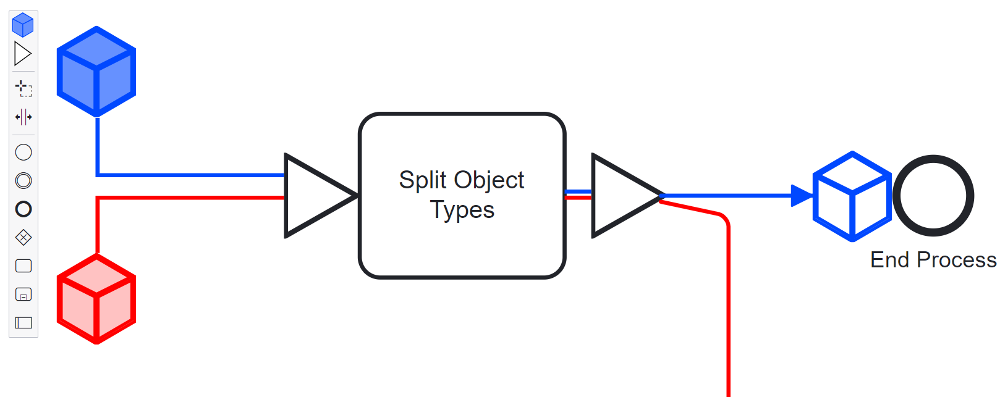

> :warning: Should ocbpmn elements be serialized within the BPMN 2.0 diagram? If that is the case, this example is not what you are looking for. Checkout our [:notebook: ocbpmn elements guide](https://github.com/bpmn-io/bpmn-js-examples/tree/master/ocbpmn-elements) to learn how to build ocbpmn elements in a BPMN 2.0 compatible way.


# bpmn-js example: ocbpmn Shapes

[](https://github.com/bpmn-io/bpmn-js-example-ocbpmn-shapes/actions/workflows/CI.yml)

This advanced example shows how to extend [bpmn-js](https://github.com/bpmn-io/bpmn-js) with new shapes and connections that are __not part of the BPMN 2.0 diagram / incompatible with the BPMN 2.0 standard__. Consult our [:notebook: ocbpmn elements guide](https://github.com/bpmn-io/bpmn-js-examples/tree/master/ocbpmn-elements) to learn how to extend the toolkit in a BPMN 2.0 compliant way.

## About

This example extends [bpmn-js](https://github.com/bpmn-io/bpmn-js), creating a ocbpmn BPMN modeler that can display and add ocbpmn shapes and connections to BPMN 2.0 diagrams.

The renderer ships with ocbpmn rules that define which modeling operations are possible on ocbpmn shapes and connections.
It can import ocbpmn shapes and connections from a [JSON](http://json.org/) descriptor and updates their properties during modeling.




## Usage Summary

The example provides a [ocbpmn modeler](app/ocbpmn-modeler/index.js). After instantiation, the modeler allows you to add and get ocbpmn shapes and connections.

```javascript
// add ocbpmn elements
var ocbpmnElements = [
  {
    type: "ocbpmn:triangle",
    id: "ocbpmnTriangle_1",
    x: 300,
    y: 300
  },
  {
    type: "ocbpmn:connection",
    id: "ocbpmnConnection_1",
    source: "ocbpmnTriangle_1",
    target: "Task_1",
    waypoints: [
      // ...
    ]
 }
];

ocbpmnModeler.addocbpmnElements(ocbpmnElements);


// get them after modeling
ocbpmnModeler.getocbpmnElements(); // all currently existing ocbpmn elements
```

The modeler ships with a [module](app/ocbpmn-modeler/ocbpmn/index.js) that provides the following [bpmn-js](https://github.com/bpmn-io/bpmn-js) extensions:

* [`ocbpmnContextPadProvider`](app/ocbpmn-modeler/ocbpmn/ocbpmnContextPadProvider.js): A ocbpmn context pad that allows you to connect ocbpmn elements to BPMN elements
* [`ocbpmnElementFactory`](app/ocbpmn-modeler/ocbpmn/ocbpmnElementFactory.js): A factory that knows about how to create BPMN and ocbpmn shapes
* [`ocbpmnOrderingProvider`](app/ocbpmn-modeler/ocbpmn/ocbpmnOrderingProvider.js): A provider that ensures ocbpmn connections are always rendered on top
* [`ocbpmnPalette`](app/ocbpmn-modeler/ocbpmn/ocbpmnPalette.js): A ocbpmn palette that allows you to create ocbpmn elements
* [`ocbpmnRenderer`](app/ocbpmn-modeler/ocbpmn/ocbpmnRenderer.js): A renderer that knows how to draw ocbpmn elements
* [`ocbpmnRules`](app/ocbpmn-modeler/ocbpmn/ocbpmnRules.js): A rule provider that defines the allowed interaction with ocbpmn elements
* [`ocbpmnUpdater`](app/ocbpmn-modeler/ocbpmn/ocbpmnUpdater.js): An updater that updates business data while the user interacts with the diagram


## Build and Run

```
# install dependencies
npm install

# spin up development mode
npm run dev

# execute tests
npm test
```


## License

MIT
